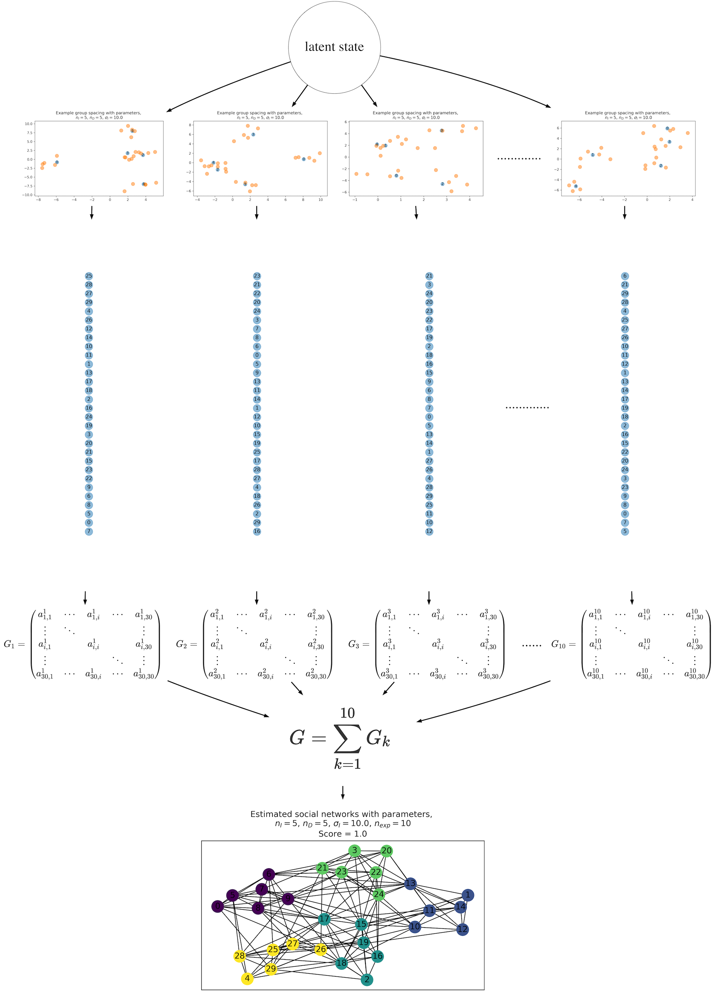

# mix_gauss_caravan_sna
This is the simulation code used in the manuscirpt,
Koda and Matsuda "A simulation experiment to reconstruct the social structures by observing the collective movements (tentative title)".

## Requirements
This code is worked under python3 or anaconda3 with:
- Python 3.6.9 :: Anaconda, Inc.
- numpy 1.17.4 
- matplotlib 3.1.1
- scipy 1.3.2 
- networkx 2.4
- python-louvain 0.13
- Tested on Mac OS 10.15.3

## Usage
- Main code for the simulation is `collective_movement.py`.
- 2 command arguments are prepared.
- the 1-st argument is a parameter, SD ratio of independenter per depender (see explanations below for details). *Integer*.
- the 2-nd argument is a parameter, experiment number (see explanations below for details). *Integer*.
- Run the following code in your terminal.

```python collective_movement.py arg1 arg2```


## Overviews of the simulations
The aim of our simulations was to examine if the individual-by-individual serial ordered movements, i.e., "animal caravan", provide a sufficient information to reconstruct the cluster organizations, which are typically assumed in the animal social group such as primates. 
We performed the computer simulations by the agent-based models, which mainly contained the four steps: 1) the models generated the animal agents to distribute in the 2-dimensional space with the latent cluster organizations, 2) the generated agents were serially aligned following an assumption of the simple collective movement rule (generating the "caravans"), 3) the social networks were computed by the association index defined by the serial orders of the caravans, and 4) finally we evaluated the cluster organization based on the generated social networks. 

## Schematic illustration of the simulation process



The schematic illustration of the simulation process. In this example, the parameters set as follows: $n_{I} = 5, n_{D} = 5, \sigma_{I} = 10, \sigma_{D} = 1, n_{exp} = 10$. The simulation started from the spatial distributions of the agents generated from one latent state of the social group organizations, determined by the parameters of the mixture Gaussian processes, $n_{I},n_{D},\sigma_{I},\sigma_{D}$ (The two top layers). Then, the "caravan" data sets were generated by the process described in the section of ordered alignment of the agents. Here, the vertical chains of the 30 circles represents the caravan (the number of each circle represent the agent id). The adjacency matrices $G_{k \in \{1,2,...10\}}$ were generated from the orders of the caravan data set, and were convolved to the one adjacency matrix $\bm{G}$, which was passed to the social network analysis. Finally, we generated the social network graph, with the clustering of the local community (the bottom graph). This flow is the single simulation process, and we run this process for 100 times.
